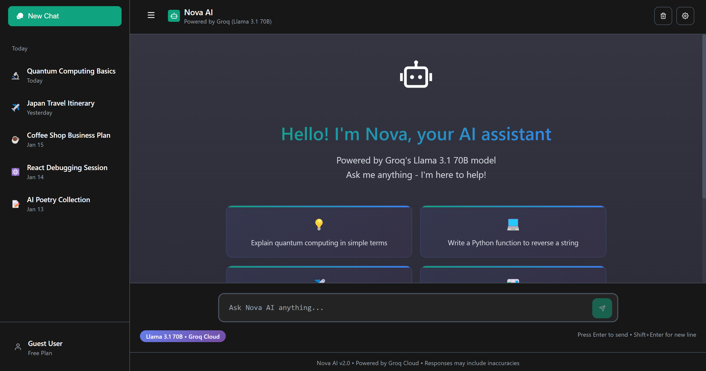
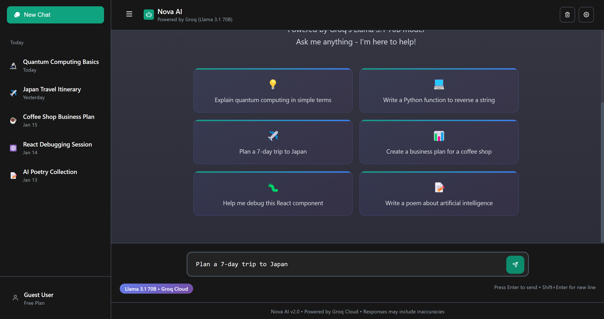
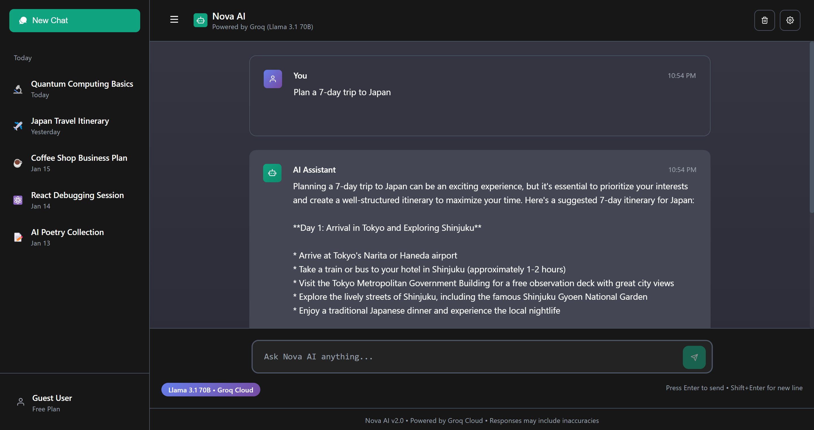
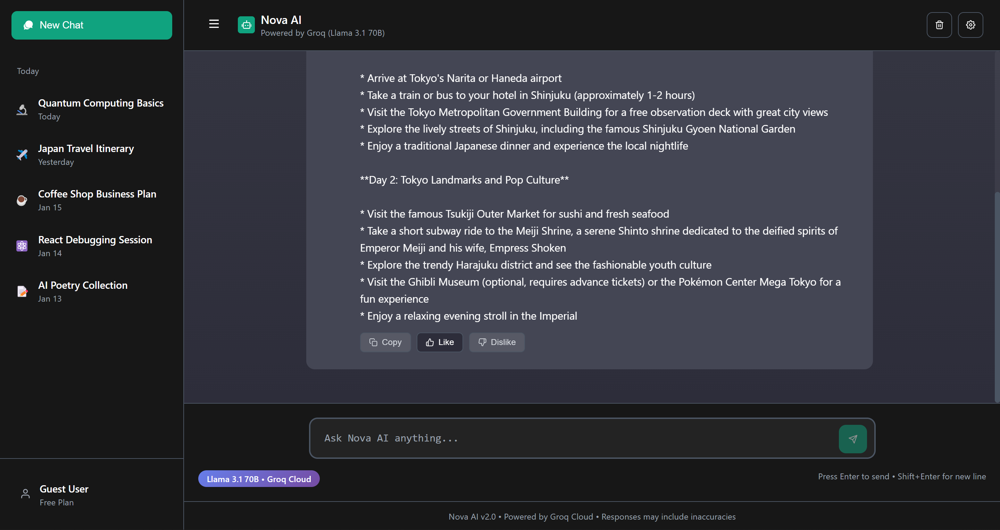
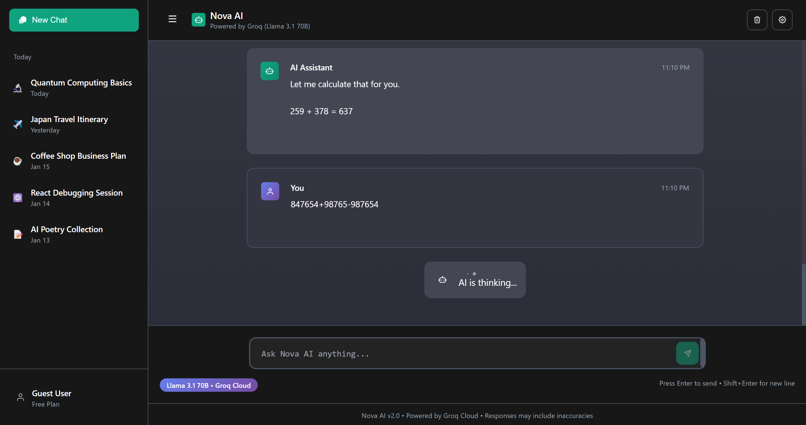

# 🤖 Nova AI - Smart AI Assistant

A full-stack AI chatbot application powered by Groq's LLaMA 3.1 70B model, providing an intelligent conversational experience with real-time responses, chat history, and session management.

## 🔍 Overview

Nova AI is a smart AI assistant that enables users to have natural conversations with an AI-powered chatbot. The application provides a modern ChatGPT-like interface where users can create conversations, interact with the assistant, and manage previous chat sessions.

The system uses a Flask-based backend API to process user requests, integrates Groq Cloud's LLaMA 3.1 70B model for generating intelligent responses, and stores conversation data using PostgreSQL.

## 🛠️ Tech Stack

- ⚛️ React.js
- 🎨 CSS
- 🐍 Python Flask
- 🐘 PostgreSQL
- ⚡ Groq Cloud API
- 🦙 LLaMA 3.1 70B Model

## ✨ Features

- 🤖 AI-powered chatbot using Groq LLaMA 3.1 70B
- 💬 Real-time conversations
- 📝 Chat session management
- 🗂️ Conversation history
- ⚡ Fast AI response generation
- ⏳ AI thinking/loading indicator
- 📋 Copy AI responses
- 👍 Like and dislike response feedback
- 💡 Suggested prompts for quick interactions
- 📱 Modern responsive chat interface
- 🗄️ Persistent data storage with PostgreSQL

## 📸 Screenshots

### 🏠 Nova AI Interface

### 💬 Chat Sessions

### 🤖 AI Conversation Response

### 👍 Response Feedback Actions

### ⏳ AI Thinking State

